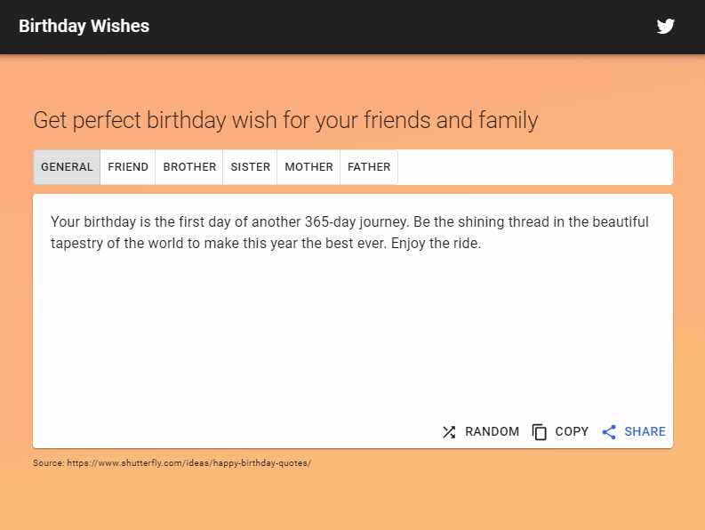
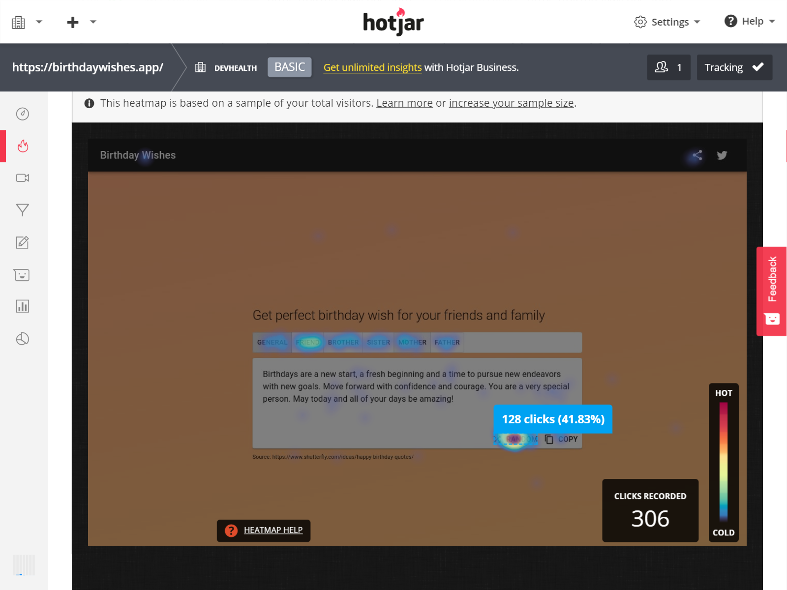
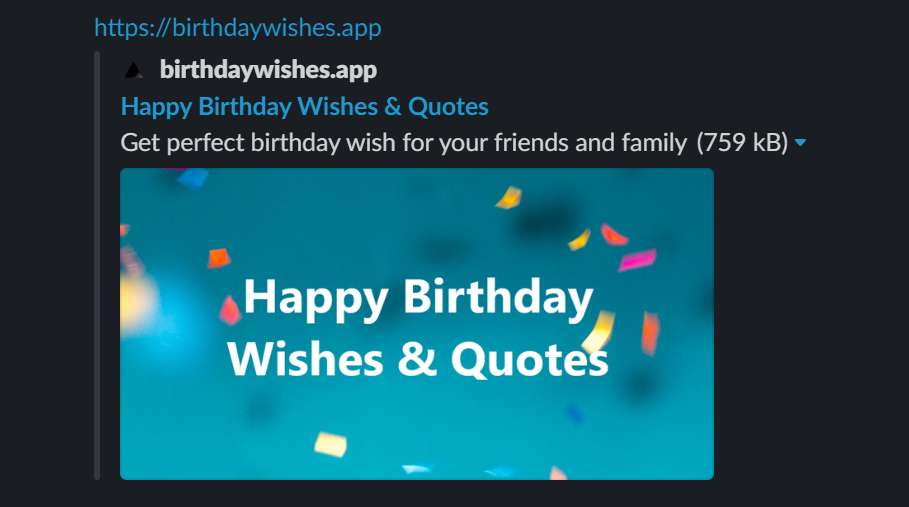

The streak of creating side projects continues. Recently, I made a simple web application to help you find the perfect birthday wish for your friends and family.

### Idea

I often find myself searching for unique birthday wishes to send to my friends on LinkedIn and Facebook. There are plenty of blog websites where you can get wishes. My idea was to aggregate the wishes into a single application where you can copy and use them.

This is how the birthday wishes app came to be. I'm not using any fancy artificial intelligence to generate the wishes, I just gather them from other websites and display them.

There is also an option of generating a pretty image with the birthday wish in it, which you can share with others.

### Market research

I fired up the [Google Keywords Planner tool](https://ads.google.com/home/tools/keyword-planner/) and saw that people search for the birthday wish ideas on Google. I adjusted the filters to show global results in the English language.

I used these results to design the user interface of the app. I decided to show wishes for anyone, friends and family members.

### Implementation

Lately, I carried out a few side hustles and wanted to establish a common way of scaffolding new projects. I usually pick the same tech stack, because I can quickly get started and focus more on the application than the environment and setup. I want to develop a new project without worrying about the tools I am using.

This is why I created a [boilerplate project on GitHub](https://github.com/jamzi/nextjs-boilerplate). It is based on the NextJS framework using TypeScript and comes bundled in with Google Analytics and Sentry error reporting tool.

Feel free to check it out and use it in your projects.

### User testing

I have no problems building apps and solving technical challenges, but when it comes to designing and creating a good user experience, I still have a lot to learn. This is why I started learning about it on this project.

> I found a great article describing a case study of fellow Slovenian designers redesigning one of the most visited websites in Slovenia. It talks about user flows, user personas, usability testing, etc. Check it out [here](https://klemenselakovic.com/partis-klemen-selakovic).

To get some insights on how the users are using the app, I installed a plugin called Hotjar. It shows a heatmap of where on the website the users are clicking. The tool shows you the overview of most clicked elements on the page and you can even record user sessions.

This combined with Google Analytics should provide me with some data on how users are using my app.

### Launch

I wanted to get a lot of user feedback before launching this app, so I posted an MVP version after a weekend of coding to the UX and UI Reddit groups. I got a few positive comments on the app and some suggestions on how could I improve and better guide the user through the app.

I also noticed it's really important to create good screenshots and preferably an animated short video about your product to intrigue the potential users.

I will launch the app on the usual channels, such as social media and product websites, like ProductHunt and Indie Hackers.

#### SEO

People are usually searching for birthday wishes on Google. This is why I want to rank higher with my website for search terms like "birthday wish", "birthday quotes" and specific terms such as "birthday wishes for brother".

After a quick research on some SEO techniques, I added the "classics" to the app: modifying the title and header tags to include the most searched keywords. The site is also pretty fast because we are using the latest server-side rendering framework and this should help it rank higher.

Besides that, I also edited my meta tags, meaning that posting a link to my website on social media will look fabulous (with image and everything). I used a tool called [HeyMeta](heymeta.com), which lets you check and fix your meta tags in the head of the website.

### Overview

With the Birthday wishes app, I want to provide value and help people find cool and unique birthday wishes.

If I succeed at it, users will visit the page and then I can think about monetization options. These could be providing personalization options to birthday wishes or connecting users with referrals to gift websites.

If the page receives a lot of traffic, putting some ads on the page is a possibility as well.

Check out the page at https://birthdaywishes.app/.
