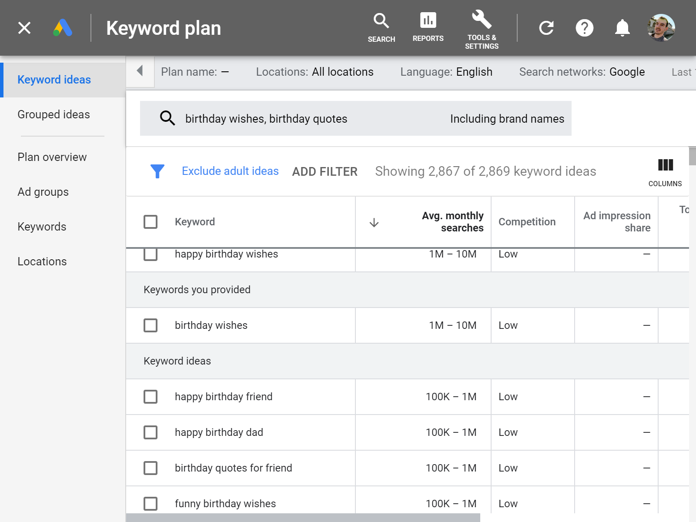

The streak of creating side projects continues. Recently, I made a simple web application to help you find the perfect birthday wish for your friends and family.

### Idea

I often find myself searching for unique birthday wishes to send to my friends on LinkedIn and Facebook. There are plenty of blog websites where you can get the wishes and I thought I could aggregate the wishes to a single application where you can copy and use it.

This is how the birthday wishes app came to be. I'm not using any fancy artificial intelligence to generate the wish, I just gather them from other websites and display them.

There is also an option to generate a pretty image with the birthday wish in it, which you can share with others.

### Market research

I fired up the [Google Keywords Planner tool](https://ads.google.com/home/tools/keyword-planner/) and saw that people search for the birthday wish ideas on Google. I adjusted the filters to show global results with English as a language.

I used the info on which categories are they searching for designing the user interface. I decided to show wishes for everyone, friends and family members.

### Implementation

I created a few side projects lately and wanted to establish a common way of scaffolding new projects. I usually pick the same tech stack, because I can quickly get started and focus more on the application than the environment and setup. I want to develop a new project without worrying about the tools I am using.

This is why I created a [boilerplate project on GitHub](https://github.com/jamzi/nextjs-boilerplate). It is based on the NextJS framework using TypeScript. It also comes bundled in with Google Analytics and Sentry error reporting tool.

Feel free to check it out and use it in your projects.

### User testing

I have no problems building things and solving technical challenges, but when it comes to design and user experience, I have a lot to learn.

This is why I started learning about it on this project.

> I found a great article describing a case study of fellow Slovenian designers redesigning one of the most visited websites in Slovenia. It talks about user flows, user personas, usability testing, etc. Check it out [here](https://klemenselakovic.com/partis-klemen-selakovic)

To get some insights on how are the users using the app, I installed a plugin called Hotjar. It shows a heatmap of where are the users clicking on the website. You can see which elements are they clicking or you can even record their session.

This combined with Google Analytics should provide me some data on how users are using my app.

### Launch

I wanted to get a lot of user feedback before launching this app, so I posted an MVP version after a weekend of coding to the UX and UI Reddit groups. I got a few positive comments on the app and some suggestions on how could I improve and better "guide" the user through the app.

I will launch the app on the usual channels, such as social media websites and product websites like ProductHunt and Indie Hackers.

I noticed it's really important to create good screenshots and preferably an animated short video about your product to intrigue the potential users. I'll also do a check and review on my SEO efforts.

#### SEO

People are searching for birthday wishes on Google. This is why I want to rank higher with my website for search terms like "birthday wish", "birthday quotes" and specific terms such as "birthday wishes for brother".

After quick research on some SEO techniques, I added the classics like modifying the title and header tags to include the most searched keywords. The site is also pretty fast because we are using the latest server-side rendering framework and this should help it rank higher.

I also edited my meta tags, meaning that posting a link to my website on social media will look pretty (with image and everything). I used a tool called [HeyMeta](heymeta.com), which lets you check and fix your meta tags in the head of the website.

### Overview

With the birthday wishes app, I want to provide value and help people find cool and unique birthday wishes.

If I succeed at it, users will visit the page and we can think about monetization options later.

These could be providing personalization options to birthday wishes or connecting users with referrals to gift websites. If the page receives a lot of traffic, putting some ads on the page could be a possibility as well.

Check out the page at https://birthdaywishes.app/.
