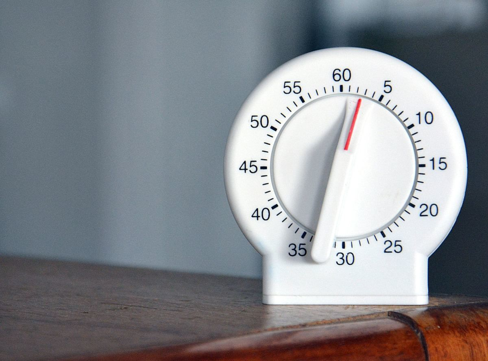
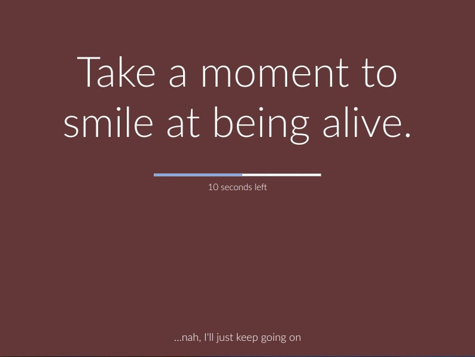

> A break at work is a period of time during a shift in which an employee is allowed to take time off from his/her job. It is a type of downtime. There are different types of breaks, and depending on the length and the employer's policies, the break may or may not be paid. (Wikipedia).

### Guilt

People often feel guilty if they stand up and take a break. It's especially true for people in tech and maybe the newcomers like interns or junior programmers. Hustling hard is the new norm, and I don't have anything against hard work if you play it smart.

### Benefits

Taking a break in your work hours is right for you. It keeps you to improve focus, keeps you from getting bored and helps you figure out a problem if you are stuck on it. The thing is that when you are frustrated and stressing out over a hard task, just taking a break and putting it in your subconscious mind may help you solve it.

Walking, talking to coworkers, playing a video game can help you relax, and the insights will come quicker when you are in a relaxed state.

> "Walk and talk." One type of I saw while visiting a client in the US is the walking meeting type. Instead of sitting in a conference room, you take a more active and personal approach and do a round or two around the block while discussing. It's great if you need to address how to solve a problem or come up with something more creative.

### Lunch break

Great way to relax, socialize and de-stress during the workday is to take a lunch break. Almost all employers allow a 20-30 min break for lunch.

It is common in some Asian countries to take an after lunch nap. It's true for factory workers, people in offices and you can also see people sleeping on subways and buses. The napping culture and the benefits from replenished energy after the short nap can be seen in some high tech companies as they provide sleeping pods or beds for employees.

### Methods

You should take a break from work at least every 2 hours. Move away from the workplace and walk or stretch out. Get some water, talk to the colleagues or take a short walk.

There are some well known and researched time management methods that you can apply in your daily work.

The most known is the Pomodoro technique.

> The Pomodoro Technique is a time management method developed by Francesco Cirillo in the late 1980s. The technique uses a timer to break down work into intervals, traditionally 25 minutes in length, separated by short breaks. Each range is known as a Pomodoro, from the Italian word for 'tomato,' after the tomato-shaped kitchen timer that Cirillo used as a university student. (Wikipedia)

There are also other methods, similar to the Pomodoro technique, like working in 90-minute work blocks or 52-17, working for 52 minutes and taking a break for 17 minutes.

All these techniques work the same, emphasizing that our brain is not meant to work for hours and hours. We should figure out the ideal length of a work block and take a break in-between to refresh.

### Tools

If you often forget to take a break or don't use a strict Pomodoro technique app, you can use [Stretchly](https://github.com/hovancik/stretchly).

It is a cross-platform open-source app that reminds you to take breaks when working with the computer. It'll tell you for extended rests and micro breaks in between work block like stretching, closing your eyes and standing up.

### Conclusion

Taking a break in your work day is really important to replenish energy. You can follow a common time management methods or just figure out what works for you. Using a tool like Stretchly can help you develop the habit of taking breaks.

Do you use a time management method like Pomodoro technique? If so, what is your experience with it?

### Resources

https://hbr.org/2015/08/how-to-do-walking-meetings-right (Walking meetings)
https://github.com/hovancik/stretchly (Strechly app)
