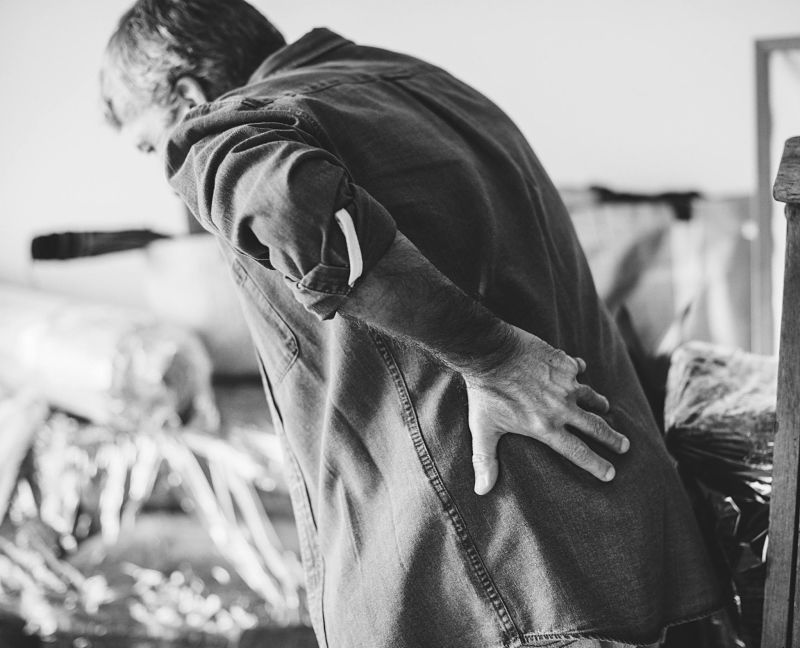
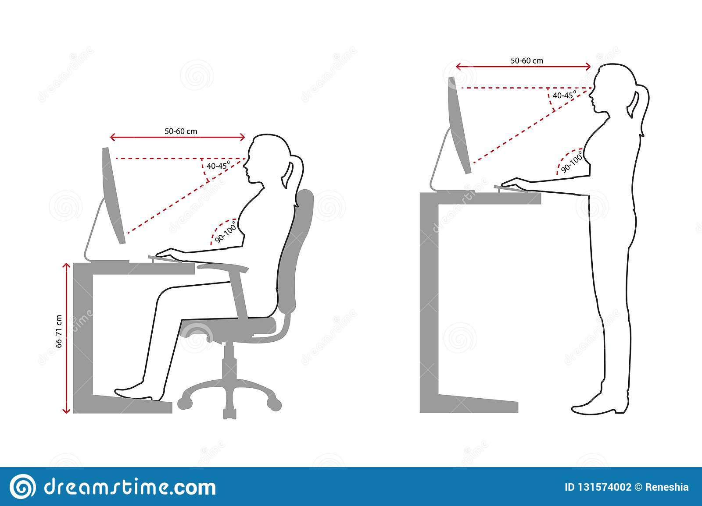

> The definition of computer ergonomics is the practice of fitting the set up of the computer and the workspace to fit the user and the user's work needs in order to minimize physical stress on the computer user (Your dictionary).

Developers sit in front of computers for hours on end. As you may already know, sitting is not the most natural position for humans to be in for a prolonged period of time. Small repetitive strain on the body from bad posture can cause people to experience muscle strain and headaches.

Being aware of the body position you are in during work can help reduce or completely mitigate bad posture habits. On the contrary, just getting a shiny new expensive standing desk will not solve all your problems.

### Computer ergonomics

The general principle of ergonomics is to keep the body in a neutral position and avoid slouching over. Take time to set up the work environment so you can feel better and be more productive later.

- **Computer screen**. Laptop screens are not ergonomically designed products, because the screen is too low and we lean in towards it. Having an external monitor about an arm's length away is the first step towards a better workplace. Eyes should be aligned about 5 cm (2 in) below monitor height.
- **Chair**. Try different ones. Generally, a chair should have a good lumbar support, be taller than your neck and adjustable. Modify it according to the height of the table so your elbows are at a 90-degree angle. Use a footrest if your feet don't reach the floor.
- **Light**. Having sufficient light when working with a computer can help reduce eye strain.
- **Wrists**. Using palms for support when typing can reduce risks of damaging the wrist.
- **Breaks**. Our bodies are built to move, not to sit. Take regular breaks. It's recommended to do it about every 30 minutes. Find more about taking breaks in [my previous article](https://devhealth.io/breaks/).

### Standing Desks

Sit-stand workstations are becoming really popular, especially in the tech world. However, completely switching to standing all day will not be much better than sitting. It's important to change the position often. Try to do it every hour or so. There has been a study concluding that people who stand more at work tend to spend less time sitting at home and are living a more active lifestyle.

> In 2015, Denmark passed a law making sit-stand desks a legal requirement for the employees who work more than 30 hours per week. This is why Danish design has been prevalent in the sit-stand desk industry.

### Other equipment

- **Mouse**. If you have large hands, then choose a bigger mouse. There are also some specially designed ergonomic mouses like [Logitech MX Vertical](https://www.logitech.com/en-us/product/mx-vertical-ergonomic-mouse).
- **Apps**. There are apps like Stretchly that remind you to take breaks.

### Conclusion

Invest in the workspace or ask your employer to provide you with the best possible equipment.

Taking good care of your body by minimizing the stress will help increase productivity in the long run. Adding to that, doing regular exercise or going to a stretching session like yoga can help you relieve the built-up tension.

### Resources

<iframe width="100%" height="300" scrolling="no" frameborder="no" allow="autoplay" src="https://w.soundcloud.com/player/?url=https%3A//api.soundcloud.com/tracks/604938687&color=%23ff5500&auto_play=false&hide_related=false&show_comments=true&show_user=true&show_reposts=false&show_teaser=true&visual=true"></iframe>

- https://www.reddit.com/r/pcmasterrace/comments/3lws30/im_an_ex_40hr_a_week_wow_player_for_more_than_8/ (Guide to relieving back pain)

- https://www.uhs.umich.edu/computerergonomics (Stretching exercises)

- Correct sitting and standing posture image (Illustration 131574002 © Reneshia Maanas - Dreamstime.com)
