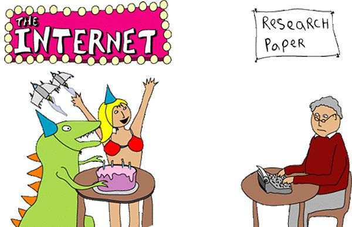
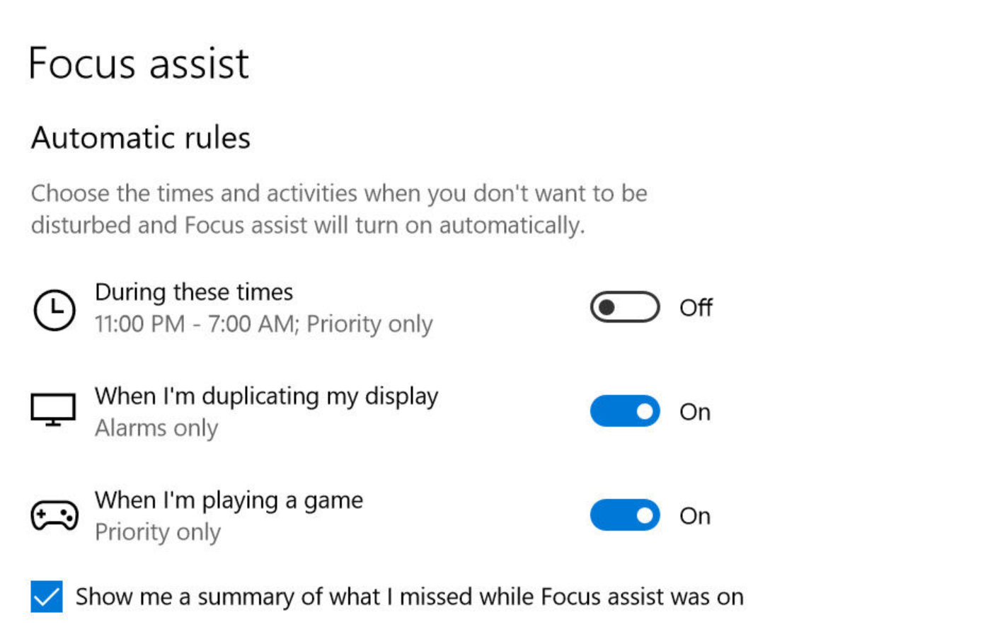
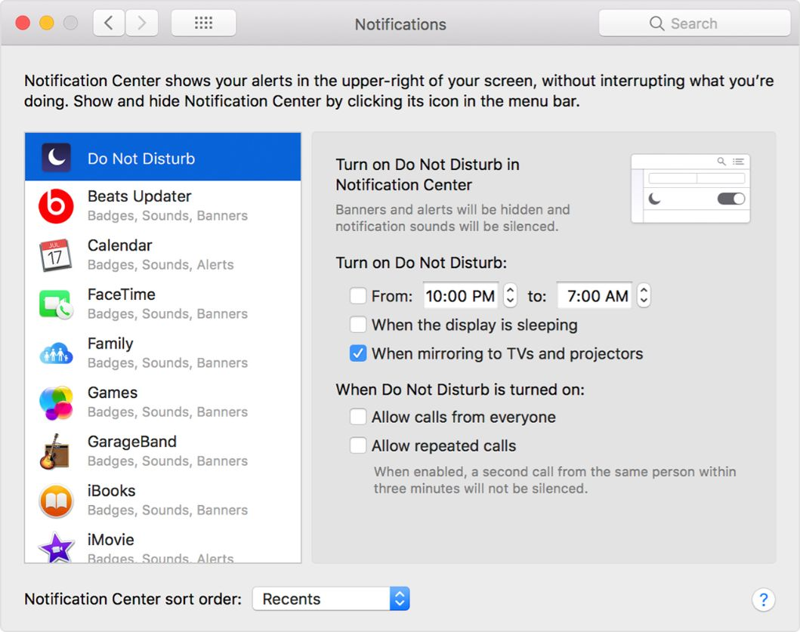

> "One way to boost our will power and focus is to manage our distractions instead of letting them manage us" (Daniel Goleman).

We get constantly triggered by the stimulus of distractions such as notifications, advertisements, and noises. UC Irvine study found that a typical office worker gets interrupted every 11 minutes – yet it takes an average of 25 minutes to return to the original task.

To evaluate the importance of these stimuli, ask yourself if it's crucial and do you really need to be bothered. If the answer is negative, it can wait until the pause.

**This is a practical guide on how to survive the distractions in both work and private life.**

### Workplace distractions

Let's see what distractions are most common in a typical work environment and how can we tame them.

- **Noise**. Working in an open office plan is connected with high decibel levels. Having a good pair of headphones, preferably noise-canceling one, will help out tremendously. Having headphones on is a common sign that you are focusing on the work and don't want to be bothered. Asking coworkers questions or receiving feedback is essential, but it should be done in a non-blocking matter.
- **Smartphone**. Unless you are a mobile app developer, smartphone usage during work can be easily avoided. Leave it in the backpack or turn on Do Not Disturb mode. Constantly checking social media, messages or receiving calls will kill a line of thoughts and hurt productivity.
- **Shallow work**. Prioritize the work and try to do the hardest thing first when you still have energy and mental focus. Check email/instant messages in batches when you have a pause. Try out some time management methods like the Pomodoro technique, where you work without distractions for 25 minutes and have a 5-minute break. Learn more about breaks in a dedicated [article](https://devhealth.io/breaks/).
- **Clutter**. Having a clean office and desk with make focusing on work much easier.
- **Hunger**. Brain cells require twice as much energy as the other body parts. Make sure you are not starving when beginning work, otherwise the mind can be easily distracted.

### Do not disturb mode

#### Windows

Focus assist is a built-in feature of Windows 10, access it under Settings - System - Focus Assist. It allows you to set the level of DnD (Off, Priority only or Alarms only).

One useful feature is also to define an automatic rule where a time period for focused work can be fine-tuned.

#### MacOS

Apple's operating system also has good support for Do Not Disturb mode. Set it in System Preferences - Notifications - Do Not Disturb, where you set active hours and exceptions.

Toggle DnD mode on-demand in the Notifications panel on the right.

#### Instant messaging apps

Slack or similar chat tools offer an ability to turn on DnD mode and mute unimportant channels.

#### Slack

Turn on DnD mode by clicking on the bell icon. There's also an option to set a DnD schedule.
Channels that are not crucial to your work like "random" or "food" can be muted and will not show a notification.

> Nomophobia or no-mobile-phone phobia is a fear of being without access to a working cell phone.

### Social media

Social media is designed in the way that it makes so compelling to keep on scrolling the feed as you get dopamine shots for a reward. Limit social media usage to a certain time of the day and enjoy more productive days.

#### Apps

To measure how productive you are currently and how much time is spent searching for the best "toast cat" images online, leverage the app called [Rescue Time](https://www.rescuetime.com/). It comes as a mobile and desktop app and it will track opened apps and sites.

[DistractOff](https://chrome.google.com/webstore/detail/distractoff/hdnjpdhnjfiipibogpkeemefnldahcnk) is a Chrome browser plugin which helps reduce the time spent on pages that are distracting. Add a site to a blacklist and it will show a banner reading "Shouldn't you be working" next time you visit the page. You can still proceed to the page, but there is a long delay before you are redirected forward. When you unconsciously visit the page, this will be a great help to get back to work.

### Conclusion

Improve productivity by focusing on a single task at a time, reducing as many distractions as possible and pushing through the urge to check social media.

Steal attention from distractions and focus on deep work.

### Resources

`youtube: https://www.youtube.com/watch?v=yo4GBc8S_TY`

- https://www.themuse.com/advice/this-is-nuts-it-takes-nearly-30-minutes-to-refocus-after-you-get-distracted (This Is Nuts: It Takes Nearly 30 Minutes to Refocus After You Get Distracted)

- https://www.amazon.com/Deep-Work-Focused-Success-Distracted/dp/1455586692 (Deep Work by Cal Newport)

- https://chrisblattman.com/files/2015/10/research-paper-vs-internet-comic.jpeg (Internet and research paper image)
