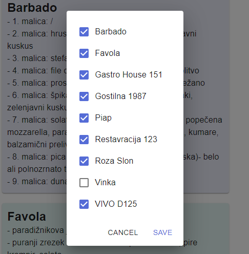
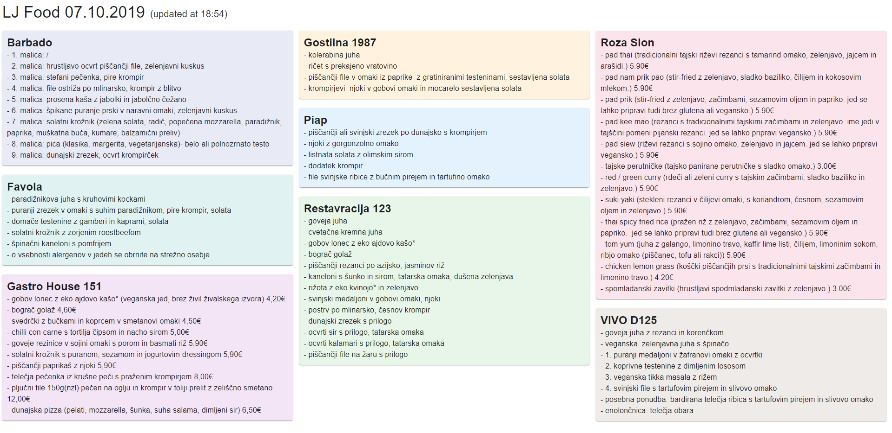
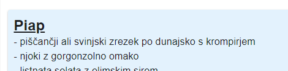
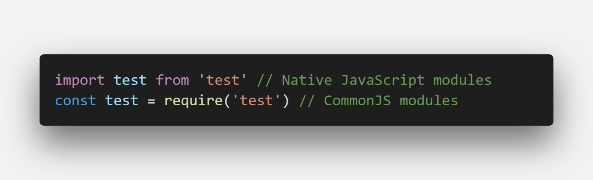
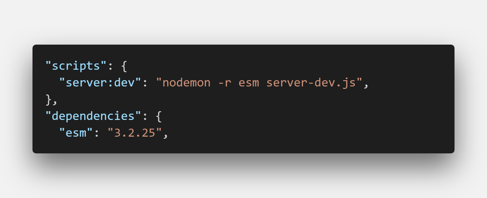

In the previous month, I set out to build a food scraper to get daily restaurant menus for nearby restaurants. You can find more about the initial setup and first MVP product in the [first post](https://devhealth.io/food-scraper/).

This article will walk you through recently added features.

### Supporting more restaurants

The existing code was a bit cumbersome, so I decided to unify the definition of the restaurants to a single file under the `constants` folder. This file is used both on the frontend and backend. To add new restaurants, all we need to do is to add the URL to the restaurant list.

The second thing that has to be added is a parser method to scrape the website. The best way is to go to the website, open the developer's tools and inspect the elements that are used to display the daily menu.

### Selecting restaurants

Another requested feature was to include an option to scrape only favorite restaurants from the list. The UI currently consists of all the menus from 9 different restaurants.

I was thinking about how to tackle this one and decided that all restaurant menus should be shown by default. If a user wants to build his list, he can hide (or blacklist) certain restaurants. I resolved this by adding a simple dialog popup where you deselect restaurants.

This scales well if we add new restaurants because the new ones will be shown as selected in the list and we can blacklist them later.

As the user deselects a checkbox from the restaurant list, we add `restaurantId` to the blacklist array behind the scenes. This array is then saved to localStorage to persist between page reloads and revisits.

### Sorting and adding colors

_Of course, Roza slon (Pink Elephant in English) has to be pink :)._

I am sorting restaurants by name ascending and the sorting occurs in the restaurant definition file. This way, everywhere the restaurant constant is used, the list is already sorted.

### Clickable restaurant title

In the restaurant definition file, we store the URLs we use to scrape the websites. I made the titles of the restaurant clickable link and this has two purposes:

- It lets you explore the website directly from the scraper.
- Because of the unreliability of the scraping techniques, if the markup on the restaurant page changes, we can still quickly lookup the menu via a link. This improves the user experience a bit.

## Lessons learned

We use different module formats on the frontend and the backend. The latter uses NodeJS standard (CommonJS) while frontend uses native JavaScript modules.

This incompatibility may not be present in the future since the NodeJS organization is working on it, but it is still an issue for the time being.

I recently watched Wes Bos scraping tutorial on YouTube and saw that he had used a package called **esm** to overcome these issues. This package lets you use native JavaScript modules on BE as well.

_We inject esm when we run the app with nodemon._

As fantastic as this sounds, there are some hidden issues here and some other packages may be incompatible with the _esm_ package. In my use case, the Puppeteer package was giving errors when used with esm, so I decided to pivot and use CommonJS modules, which are standard to NodeJS.

### What the future holds

In my main work project, we switched completely to TypeScript as the project grew. This has proven to be a smart move because of the type of safety it provides. I'm going to transition the frontend part of the app, as the newer version of NextJS supports it out of the box. I'll then move to the backend by adding a TypeScript layer to ExpressJS.

In open-source projects, documentation is something that differentiates an average side project from a great one. This is also the case for the Food scraper side project.

I intend to document the process of forking the repository and adding your restaurants. This way, people can tailor this project to their own needs. I might also add notes on how to deploy to the Zeit Now hosting, as it has proven useful.

You are more than welcome to join the project on [GitHub](https://github.com/jamzi/food-scraper), raise an issue or fork your version of the Food scraper.

### Resources

- https://food-scraper.jamzi.now.sh (Food scraper app)
- https://github.com/jamzi/food-scraper (GitHub repository)
