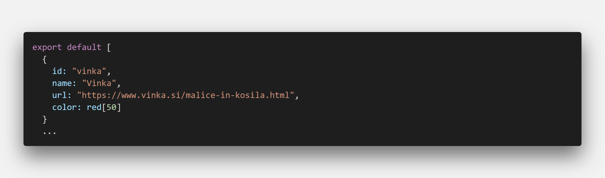
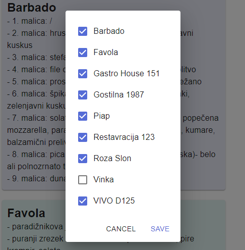
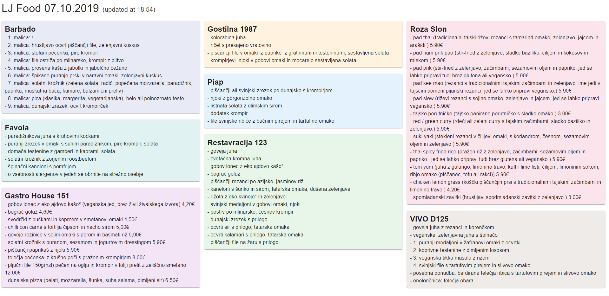
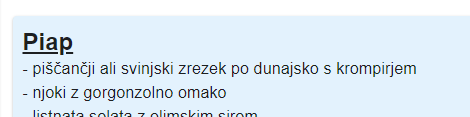
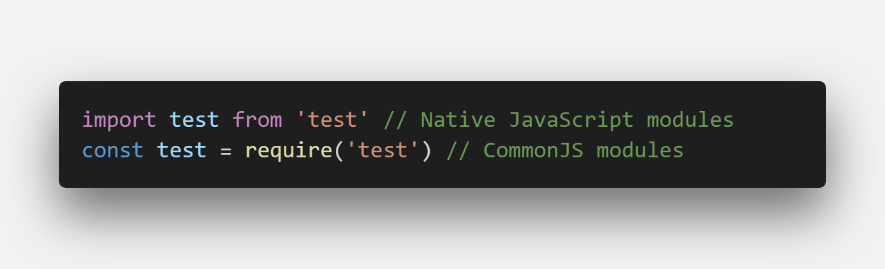
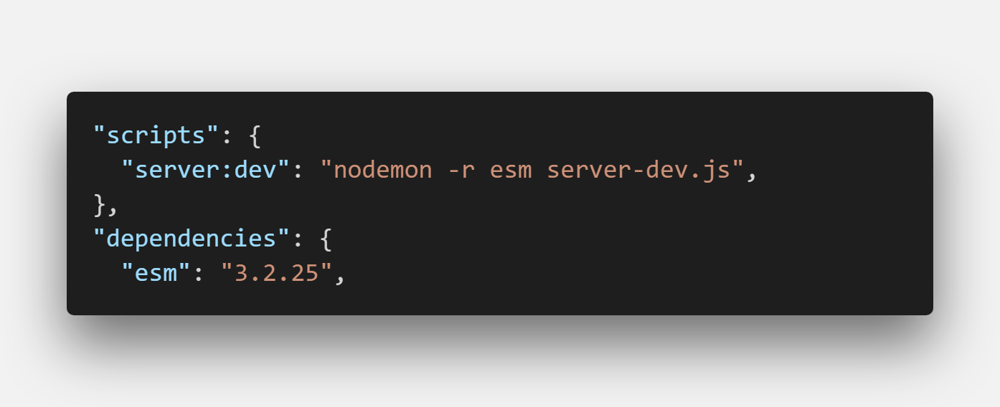

TODO: more details on first post

I set out to build a food scraper . See more details of initial setup, first MVP product in the [first post](https://devhealth.io/food-scraper/).

I'll explain a few features I added to the app recently.

### Support more restaurants

- To add new restaurants, all I need to do is to add the url to the restaurant list I unified in one file. This file servers as the truth for which restaurants do we use in the app (both on FE and BE).

- The second thing we/you need to do is to add your own parser to scrape the website. The best way is to go to the website, open developers panel (dev tools) and see which elements are used to display the daily menu.

### Select restaurants

Another requested feature was to add an ability to scrape only favorite restaurants, since the UI is currently quite filled with all the menus from 9 different restaurants.

I was thinking how to tackle this and decided that by default, all restaurant menus should be shown. Then if a user wants to build his own list, he can hide (or blacklist) certain restaurants. I dediced to go for a simple dialog popup where you deselect restaurants and by default, all of them are selected.

This also scales well if we add new restaurants, they will be selected in the list. Meaning even if you hide all restaurants except one, when a fresh one is added, you will see it.

As user deselects a checkbox from the restaurant list, we add restaurant id to the blacklist array. This array is then saved to localStorage to persist between reloads and revisits.

### Sorting and adding colors

_Pink Elephant (Roza Slon in Slovene) has to be pink._

### Add a link to the menu

- Since we already have direct url to the daily menu for each restaurant, I made the title of the restaurant item clickable (anchor tag element). This has two purposes. First is that if we want to explore the website, we can click directly from the scraper. The second one, as web scraping is not the most reliable type of data gathering, we can fallback to a link if the website content is suddenly changed and we cannot get data in the scraper. Improves the UX a bit.

## Fails

Food scraper is a monorepo and as such, we use different module formats on FE and BE. BE uses NodeJS standard, which is CommonJS and frontend uses native JavaScript modules. This incompatibility may not be present in the future, since NodeJS organization is working on it, but for time being, it is still an issue

I recently watched Wes Bos scraping tutorial on YouTube and saw that he used a package called **esm** to overcome these issues. This package lets you use native JavaScript modules on BE as well.

_We inject esm when we run the app with nodemon_

As fantastic as this sounds, there are some hidden issues here and some other packages may be incompatible with adding _esm_ package. In my use case, Puppeteer packages was giving me hard to debug issues when used with esm, so I decided to pivot and I just used CommonJS for NodeJS code.

### Future todos (pending tickets)

- Adding helpful README (show some example project with a really cool README)
- TypeScript (I used it in my job, it's proven itself really useful)
