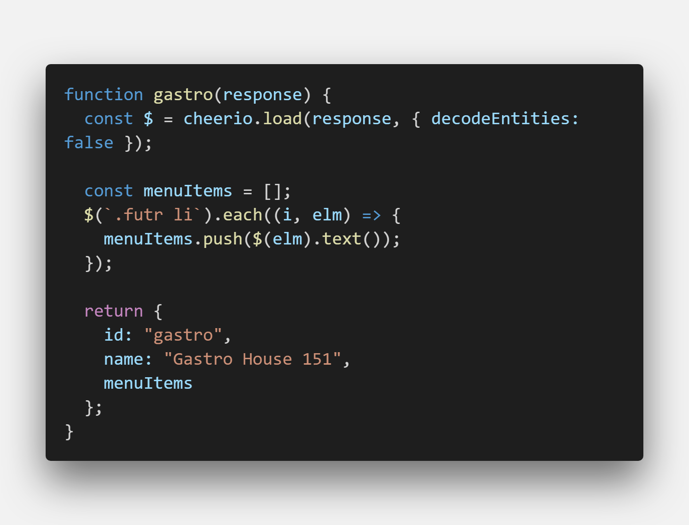
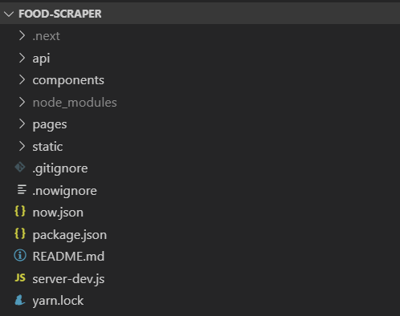
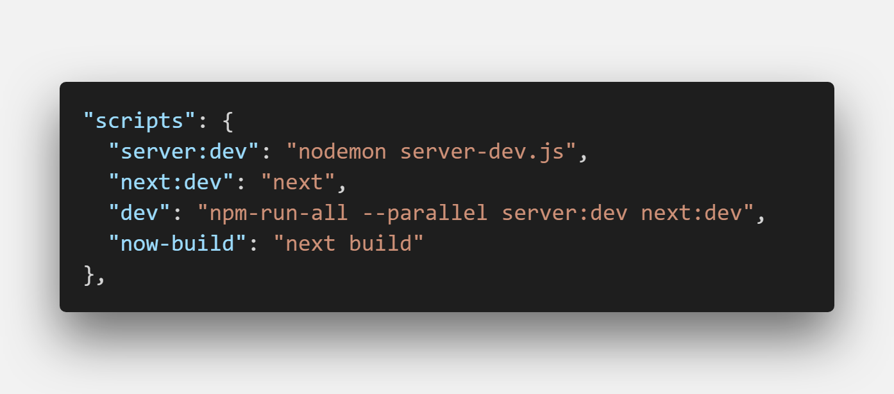
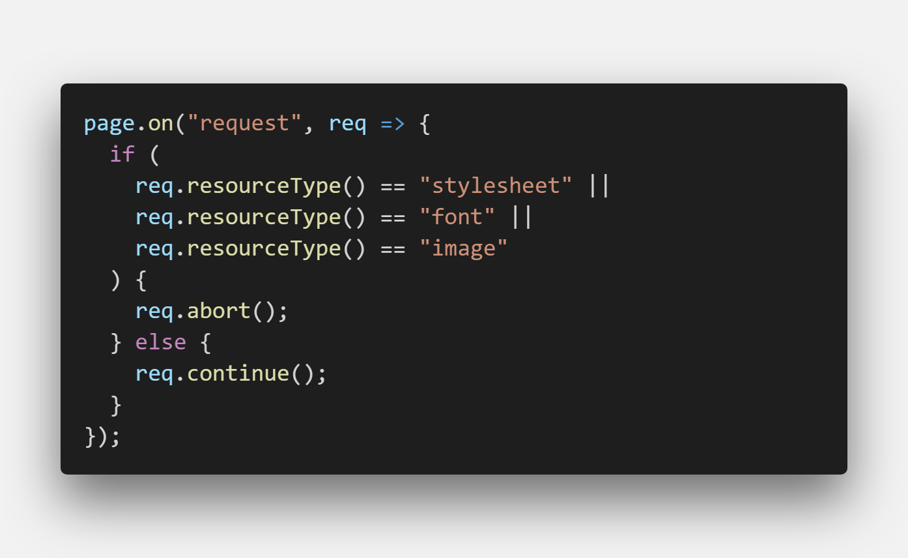
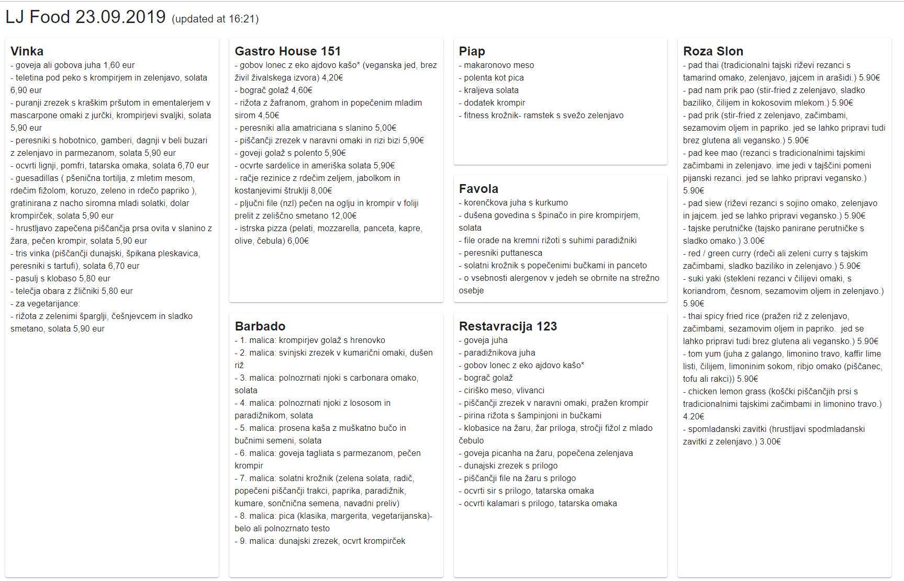

The company I work for just moved into new offices and there are two TVs in the main area where we sit that don't serve any purpose. We were discussing what should we display on these TVs. Usually, they are used to display build status of an app, but we are an agency and we work on multiple projects.

We got an idea to display daily menus from nearby restaurants to help us decide what to eat for lunch. The scraper would go to each restaurant website and get the content of a daily menu to help us figure out what to eat.

Since it sounded like a cool idea and I want to build a few [side projects](https://devhealth.io/side-projects/), I quietly set out to build an MVP version.

At the end of this article, I'll share a link to GitHub, where you can see or re-use the project for your own needs.

### How do you do web scraping?

With no knowledge of web scraping tools or libraries, but a decent knowledge of JavaScript, I started querying Google for restaurant websites. I gathered popular restaurants to which coworkers were going out to lunch and inspected their websites. Most of these sites were static, meaning no JavaScript was required to render initial content. This was great news, because I wanted to keep the first version as simple as possible.

### Tech stack

Backend is a simple NodeJS project and I used Axios HTTP client to fetch the content of the page. To select a specific element on the page, I found a recommendation to use a package called Cheerio, which adds you jQuery-like selectors to server. I used this to get content from the web page using selectors and it was cleaner than using vanilla JavaScript selectors.

I also needed a frontend part to display the restaurants and menu items. Since I use React library daily, I wanted to try something familiar and settled for NextJS, which is a nice bundled React solution. NextJS offers server-side rendered React application and allows you to integrate a custom NodeJS server. This is perfect for my use case, as I can keep the whole project as a monorepo.

A company called Zeit, creator of NextJS, also offers a deployment solution called Zeit Now. It's a CDN + Serverless offer and works well with NextJS. It deploys both frontend and backend with a single command and you can hook up your Git repository to deploy every time you push your changes to a branch.

### Scraping is a dirty job

As you saw the syntax of one example for Cheerio usage, web scraping is much more convoluted than just using an API. For example, one restaurant just dumped all the menu items text into a single paragraph and I couldn't do much restructuring of the data to fit my needs.

There were a few issues with my current approach:

- I noticed some weird behavior with special characters on one of the websites, where the page charset was set to non-utf8 and I couldn't get it to be scraped without weird-looking HTML characters.
- The whole site was quite slow. I did all of the web scrapings in the custom NodeJS endpoint and was waiting for 5 restaurants to send scraped data before displaying the UI. It wasn't the best user experience, but it was OK to prove the concept.

I deployed and presented the first version of the app to coworkers.

### First feedback

I am thankful that I got positive feedback from coworkers, who were using my app for a couple of days.

The first request I got for the scraper was to support another popular restaurant. The issue was that this restaurant's site was not completely static, but it generated a menu dynamically with JavaScript. This meant that we cannot just get the page content with an Axios HTTP request, but we needed to load the page in a browser-like environment and wait for the JS to load before getting the HTML content.

I searched the web for answers to this and found that the Google team released a tool called Puppeteer. It's a NodeJS library that allows you to control web browser in a headless environment and it's perfect for running on the server or in the command line.

### Puppeteer and Zeit Now

Zeit Now worked great for normal requests with Axios but had some issues running Puppeteer. With a bit of googling, I found that the main issue is the size of Puppeteer, as we are limited with the size of a serverless function. Full Puppeteer also includes the Google Chrome browser, but puppeteer-core compresses the size of it and is perfect for these environments. I used this version for Zeit Now deployment and added some conditional logic to run the full version in the development and the compressed version on Zeit Now.

Zeit Now offers a CLI and also has a development version (Now Dev) that you can use to reproduce their production environment on your machine. This is great, because it also supports live reload and it feels like developing a frontend app. I had some issues using Now Dev command and Puppeteer, so I just added a simple package.json script to run Express for my backend and NextJS in parallel for local development.

The problem with a site not displaying special characters was fixed just by using Puppeteer. Nice.

### It's slow!

With using Puppeteer in the app, I noticed an increase in time to get back scraped data. Puppeteer runs a Chrome instance and opens pages individually. The issue was especially noticeable with our JavaScript-powered restaurant, where we had to wait for a certain element to be present on the page before we could scrape the page.

Deploying the current version to Zeit Now, I often got runtime errors and when I checked, it said the serverless function timed out. Zeit Now has a limit of 10s execution time per free tier function.

I searched for a solution online and found out that you can disable certain request types in Puppeteer. I disabled stylesheet (CSS), fonts, and images in our requests, meaning the Chrome instance would render just text. This made the scraping a bit faster, but still not good enough.

We had to use another approach, different than executing all web scrapers together in one function.

Instead of scraping all the restaurants together in a serverless function, I created a common function where you just passed the restaurant name as a query parameter. The function then runs Puppeteer, visits the site, and scrapes the content.

On the frontend, we now do multiple requests and we treat responses individually, as we don't need to wait for other restaurants. This greatly reduces the time it takes to execute a function and it also improves loading perception, as we can add loaders to individual restaurants.

### Making it faster

Because restaurant data is published in the late morning and doesn't change often during the day, I also thought it doesn't make sense to run the scraper with each request, as we could cache the data.

Zeit Now supports lambda response caching, which I leveraged and set up to cache for 30 minutes. Adding to that, I set up a simple cron job with [EasyCron](https://www.easycron.com) to ping the endpoint from 9 a.m. to 2 p.m. every 15 min to reduce the load time when the users usually visit the page to look at the restaurant daily lunch menus.

### Overview

I'm pretty happy with current tech stack and the functionality of the app. It's great to have a small monorepo and a simple deployment process using Zeit Now.

I can also easily add or remove restaurants and write a custom scraper for each one.

If you want to check out the project, you can find it on [GitHub](https://github.com/jamzi/food-scraper).

#### Resources

- https://cheerio.js.org/ (Fast, flexible, and lean implementation of core jQuery designed specifically for the server)
- https://github.com/GoogleChrome/puppeteer (Headless Chrome Node.js API)
- https://nextjs.org/ (NextJS React Framework)
- https://zeit.co/ (Zeit Now platform)
