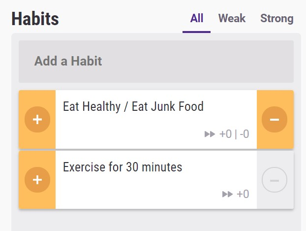

> Habits are routine behaviours done on a regular basis. They are recurrent and often unconscious patterns of behaviour and are acquired through frequent repetition. Many of these are unconscious as we don’t even realise we are doing them (MakeOrBreakHabits.com).

In a great book called _[The Power of Habit](https://www.amazon.com/Power-Habit-What-Life-Business/dp/081298160X)_, Charles Duhigg tells us that
about 45% of the decisions we made in our daily lives are habits.

To excel at forming habits, you need to train your **willpower**, which is like a muscle. Performing small steps that eventually develop into a habit will reap the most benefits.

### The Marshmallow Experiment

Willpower and successful habit performance are tightly coupled. Stanford University performed a [Marshmallow experiment](https://en.wikipedia.org/wiki/Stanford_marshmallow_experiment), where they offered children a choice of a small reward immediately in the form of a marshmallow or multiple rewards if they waited for a short period of time. Only a few children managed to resist the urge of instant gratification and delicious marshmallows.

In the follow-up study on these children, they found that the ones that managed to wait for the second marshmallow had better success in education and other life outcomes.

`youtube: https://www.youtube.com/watch?v=QX_oy9614HQ`

### Habit Formation

A successful habit contains three main ingredients. Our example habit will be going to the gym:

- **Cue**. The cue for going to the gym could be preparing the gym equipment in the evening so you are ready to go to a gym the next day.
- **Routine**. The routine for the gym would be going to the gym.
- **Reward**. It's important to reward yourself for the hard work you do. In our gym example, a reward could be to eat a piece of chocolate.

One trick I learned from watching YouTube videos from [Matt D'Avella](https://www.youtube.com/user/blackboxfilmcompany) is to implement a "two-day rule". You shouldn't break the habit, such as going to the gym, meditating, reading a book for more than **two days in a row**, because it's difficult to get back on track after losing a habit streak.

## Gamification and habit formation

To understand the concept of gamification, let's look at the video-game industry. Games, especially role-playing ones, often have elements, such as avatar, points, badges, and quests to make the game more interesting and improve user engagement.

Playing these games can be unquestionably fun. Gamification takes the same elements and applies them to real-life scenarios. The app we are going to take a look at next does just that.

### Habitica

> [Habitica](https://habitica.com) is an opensource video game to help you improve real-life habits. It "gamifies" your life by turning all your tasks (habits, dailies, and to-dos) into little monsters you have to conquer. The better you are at this, the more you progress in the game. If you slip up in life, your character starts backsliding in the game (Habitica.com).

In the app, the main domains are habits, dailies, to-dos, and rewards:

- **Habits**. You can list the habits you want to establish here. They can be positive or negative, and by completing positive habits, you gain in-app gold and experience. You also lose health by doing a negative habit.

- **Dailies**. These are recurring tasks you do every day, week, or month. The app offers fine-grained controls to set up dailies and you lose in-app health by failing to complete them. If you lose too much health, your character will die and lose a level.

- **To-dos**. The tasks you do once or rarely. Long term or more complex to-dos can be broken down with checklists. You gain experience points and gold by doing to-dos.

- **Rewards**. You can buy rewards with in-app earned gold. They are ranging from character equipment like swords and hats to custom rewards that you can define.

Habitica has a great [wiki page](https://habitica.fandom.com/wiki/Habitica_Wiki) and you can interact with your character on the go with either [iOS](https://apps.apple.com/us/app/habitica-gamified-taskmanager/id994882113) or [Android app](https://play.google.com/store/apps/details?id=com.habitrpg.android.habitica&hl=en).

### Resources

- https://www.amazon.com/dp/B0055PGUYU (The Power of Habit: Why We Do What We Do in Life and Business)

- https://www.youtube.com/watch?v=YgB_XfudqeU (How to Hack Your Habits - Matt D'Avella)

- https://markmanson.net/downloads/habits (The Guide to Habits - Mark Manson)
