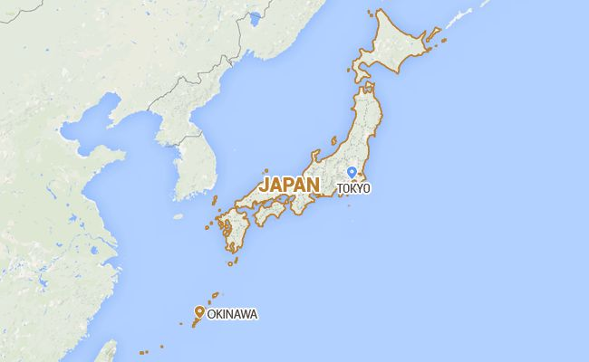
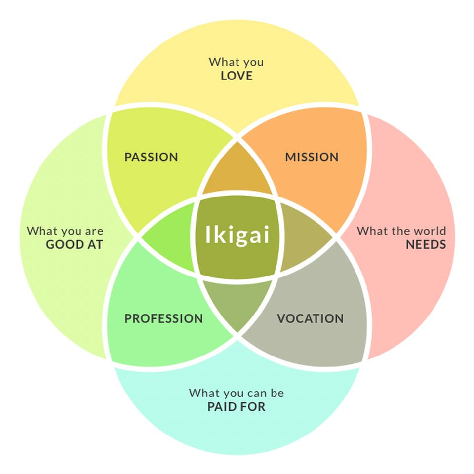

Dan Buettner in his book _[The Blue Zones: Lessons for Living Longer From the People Who've Lived the Longest](https://www.amazon.com/Blue-Zones-Lessons-Living-Longest/dp/1426207557)_ explores 5 places in the world where people live the longest and calls these locations **the blue zones**.

Buettner traveled to each of the blue zones and interviewed centenarians (individuals who reached the age of 100). Many of these elders still live independently.

He noticed a few common traits that play a role in living longer:

- **Food**. Simple, predominantly plant-based food, which is rich in nutrients.
- **Physical activity**. Many of these people have their own gardens or work long hours on the field.
- **Family and purpose**. These communities are based around family values. When people reach old years, they still have a role in the family, for example, they help to raise their grandchildren.
- **Sense of community**. People visit each other and support others in time of need.

### Okinawa, Japan

One of the blue zones that especially stands out is the island of Okinawa, Japan. It's located south of the mainland Japan and north-east of Taiwan. It has a nice, humid subtropical climate which is perfect for farming.

According to [Wikipedia](https://en.wikipedia.org/wiki/Centenarian), this is a place where there are more centenarians than anywhere in the world. In Okinawa, there are approximately 50 centenarians per 100.000 people in comparison to the US, where there are only about 20 per 100.000.

The author talks with the elders in the villages and they talk about a purpose in life called **ikigai**.

> The term ikigai compounds two Japanese words: iki (生き) meaning "life" and kai (甲斐) meaning "to be worthwhile". It can be interpreted as "a reason for living", "meaning for life" or as they like to explain it "a reason to get up in the morning" (Wikipedia).

Ikigai is a unique intersection between what you are good at and what you love. Many centenarians on Okinawa island say that they have a purpose in life, for instance taking care of their family, perfecting a craft, or gossiping.

They connect this sense of purpose with being present in the moment and having fun ("Don't worry, be happy" attitude).

This is quite different from most people living in western societies, where individuals suffer from different forms of existential crises. We have better living conditions and education than our parents and grandparents, but people still don't know what to do in life.

### Finding your ikigai

To find your ikigai, ask yourself the following questions:

1. **What do I love?**
2. **What am I good at?**
3. **What can I be paid for now — or something that could transform into my future hustle?**
4. **What does the world need?**

Here is an example of ikigai of a gym coach according to the questions above:

1. Helping people gain muscle, lose weight, and feel better in their bodies.
2. Providing clear instructions and encouragement.
3. Coaching clients and opening a gym center.
4. A mentor to help you achieve fitness goals.

**_What is your ikigai?_**

### Additional notes

After World War 2, Okinawa has changed a lot. It currently hosts 32 US military bases and is influenced a lot by American culture. This has decreased the life span of adults living there now.

Because of the changing culture and decreasing life span, I intentionally focused on the values and habits of elders living in the villages of Okinawa.

### Resources

`youtube: https://www.youtube.com/watch?v=to9rhIwWJg0`

- https://www.youtube.com/watch?v=ff40YiMmVkU (How to live to be 100+ - Dan Buettner)

- https://www.amazon.com/Ikigai-Japanese-Secret-Long-Happy-ebook (Ikigai: The Japanese Secret to a Long and Happy Life)

### Images

- https://www.thestar.com/content/dam/thestar/life/relationships/2016/09/06/why-north-americans-should-consider-dumping-age-old-retirement-pasricha/li-pasricha-pilot2.jpg (The diagram of Ikigai)

- https://i.ndtvimg.com/i/2015-10/okinawa_650x400_51444719705.png (The map of Okinawa, Japan)
