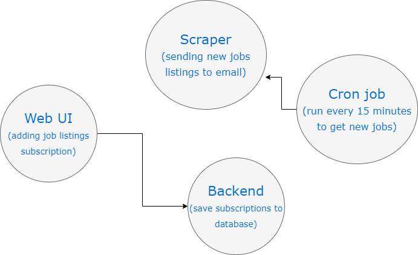
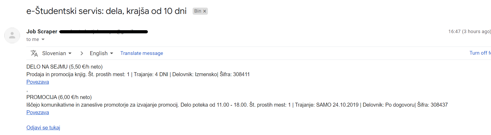
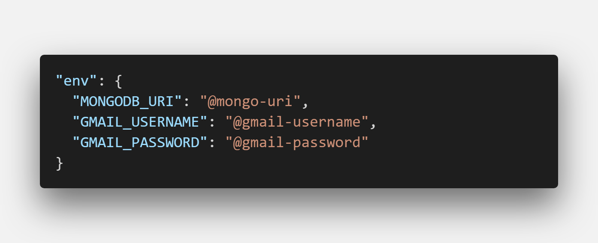

Students in my country use the e-Študentski servis website to get short-term or long-term jobs. The site supports filtering by type of work, location and other parameters as well as being subscribed to a mailing list for new jobs.

The issue with their mailing list is that it doesn't allow granular selection of the job listings you want to be notified of. For example, it's not possible to be notified just of short-term jobs in the main city which has an hourly rate of more than 6 euros.

I decided to create my own new job listings notifier using JavaScript, Zeit Now and Gmail.

### Architecture

#### Web UI

I am using NextJS on the frontend to display a simple form, where a user adds their email and the link to the job listings website, where they filtered out the jobs they want to see.

#### Backend

When you press the confirm button, the form data is sent to the backend and saved into a MongoDB database.

#### Scraper and cron job

I've set up a cron job, which runs every 15 minutes and calls an endpoint to scrape the job listings. This endpoint connects to the database to get all the subscriptions and uses the saved URL to scrape the website.

We get the latest jobs and compare if there is something new. If there is, the system will send an email to the user.

Each job listing has an id field. When the scraper is run, we save the latest job id to the database, so we know which jobs are new.

### Scraping job listings

Since the student jobs page is generated on the backend, we can easily use an Axios XHR library to get the content of the page. This is in contrast to running the whole browser environment with Puppeteer for JS rendered websites, as we did in our previous [Food scraper project](https://devhealth.io/food-scraper/).

### Knowing what to send to the user

We need to know, which is the latest job posting that the user has seen. This is why we save the `lastJobId` to the subscription data in the database.

### Cron jobs

In my previous scraping projects, I was using [EasyCron](http://easycron.com), where you have a free plan, but it's limited and you need to renew it every month. I searched for alternatives and found [cron-job.org](https://cron-job.org). This is a free service and you can specify cron job options in detail. I have set it up to trigger every 15 minutes. The service also supports showing the response of a cron job.

Initially, I had some issues calling the scrape function, which would return all the scraped data. The cron job would fail because of the large response data. I changed the endpoint for scraping to just return status code and it's been working perfectly ever since.

### Notifying users about new jobs

There are multiple ways to notify users about some new content. There are good old emails, push notifications, etc. At first, I was looking at email services like SendGrid. It's a nice service, but it requires verification of your business when I just wanted to piece something together to test it on a side project.

Then I thought about push notifications, which are a more modern and direct way to engage with a user. This also has some drawbacks, as the [web version of push notifications](https://caniuse.com/#feat=push-api) is not supported on Safari. This means that it couldn't work with iOS mobile users.

This was overwhelming, so I took a step back and re-evaluated the situation. Email is probably the only suitable option, but where to find a good free provider to use. And then I thought, I am using Gmail for both my personal and work accounts. Maybe I can just create a new Gmail account for the job scraper service and send emails from there.

Note that this approach is not suitable for email marketing, as Gmail provides a hard limit to the number of outgoing emails.

In the backend code, I used the Nodemailer package to set up Gmail email sending. To avoid flooding account with emails during the development phase, I used the fake SMTP service called [MailTrap](https://mailtrap.io/).

### Deployment

I structured the project as a monorepo and deployed it to the Zeit Now service.

To set up MongoDB and Gmail, I had to use API keys and passwords to access the service. These keys are best kept in the .env file, which is excluded from the version control. In Zeit Now deployments, you can specify environment variables in the `now.json` file and add them to the service via the `now secrets add` command. This way, only your development environment and deployment itself know about these keys.

For development, I am using `now dev` command.

Feel free to join the project on [GitHub](https://github.com/jamzi/job-scraper), raise an issue or fork your version of the job scraper.

#### Resources

- https://zeit.co/docs/v2/environment-variables-and-secrets (Zeit Now Environment Variables and Secrets)
- https://nodemailer.com/ (Nodemailer)
- https://www.mongodb.com/cloud/atlas (MongoDB Atlas)
