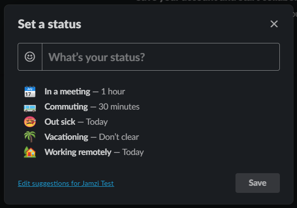
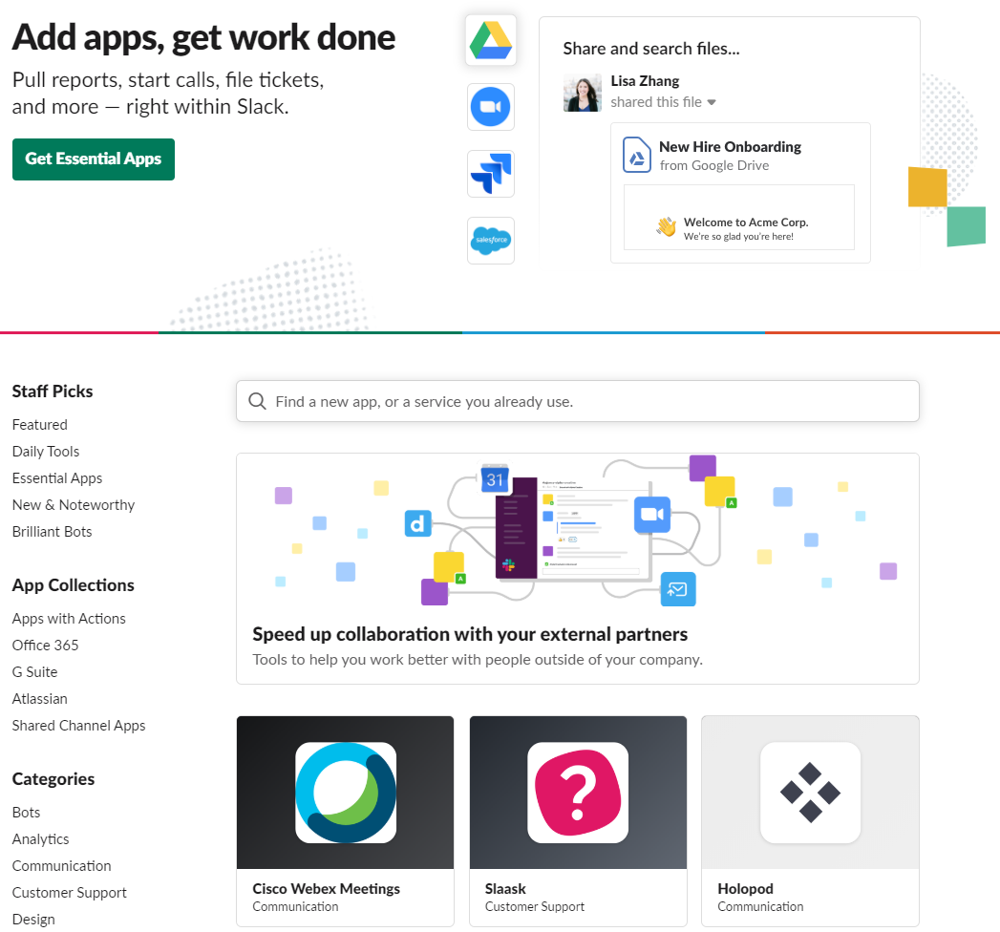
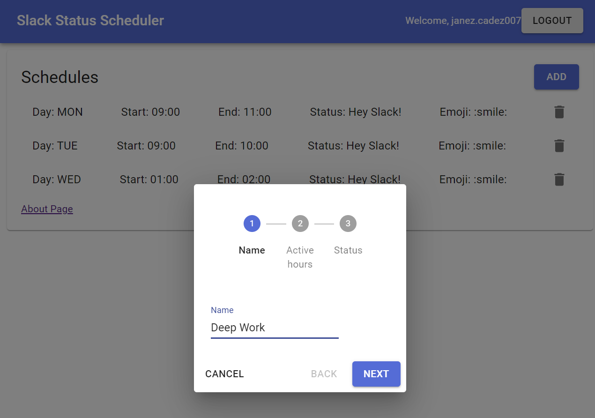
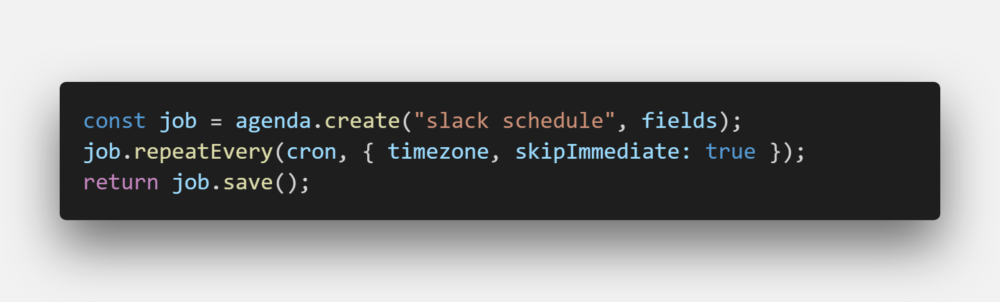
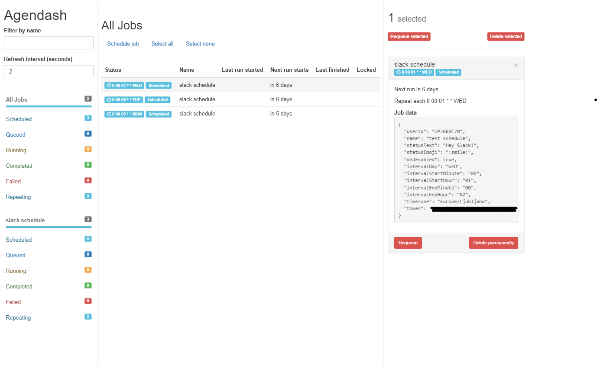
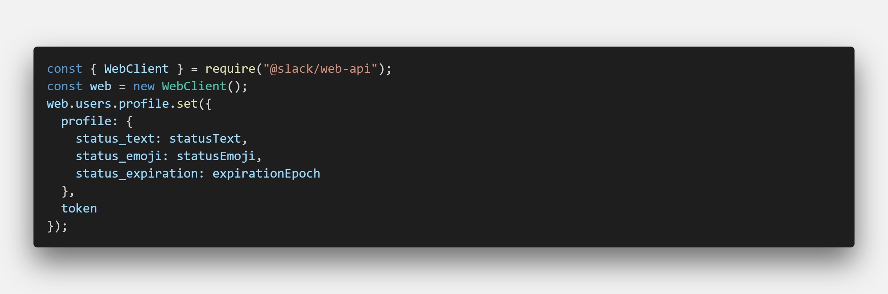

### Idea

At work, we use Slack for communication and when working from home, I just set the status manually to let my coworkers know that I'm remote.

In the [Status Scheduler for Slack app](https://slackscheduler.now.sh/), you can set the predefined status or define your own. The issue is that I always forget to set it. To help with this, I decided to build an automatic status scheduler for Slack that would do this for me.

The second benefit of such a system is that I can also schedule deep work time every day for a few hours, where I block the notifications and set the status to something like "Deep work, will reply soon". It proved itself useful as I can focus on the task at hand and check all the new messages in a batch once I'm done.

### Target audience

The app was created for the users of the Slack messaging platform. It is especially targeted for people who are conscious of the fact that Slack can bring a lot of noise into your work life if you are not disciplined to minimize the distractions.

It is also useful for people who occasionally work from home and would like to set the status automatically every week.

### Competition

Slack has an app directory, where you can browse a ton of apps and integrations. I was looking for similar products but couldn't find one that would do the specific things I described above.

The closest product that I could find is called [Don't Interrupt](http://dontinterrupt.app/), where you can schedule work hours and it will display the status for hours outside of this time window. The app offers a great user experience if you need this kind of behavior.

A lot of apps that control the Slack status integrate with your calendar and display "In a meeting" during your events. This is great, but I wanted to write custom status and optionally turn on the Do Not Disturb feature.

### Tech stack

#### Web interface

The frontend of the app is written in NextJS. It supports signing in with Slack and adding or deleting schedules. On the first page, the app lists your active schedules.

You can create a new schedule by clicking on the add button and following a three-step process:

1. add a name,
2. select active hours when the status is displayed and
3. choose the status text and emoji.

#### Scheduler

The scheduler is the heart of the application. When you create a new schedule on the frontend, it will pass it to the scheduler, which creates a cron job and persist it to the MongoDB database. I'm using the AgendaJS system for NodeJS, which provides an API to add, edit and delete cron jobs. When a cron job runs, it will execute a job that calls Slack API sets users' status and Do Not Disturb preference.

AgendaJS also offers some plugins, one of them being Agendash, which visualizes the jobs in the system.

#### Slack API

To integrate your app with Slack, you need to create a new app on https://api.slack.com/. To be able to change the user's status and Do Not Disturb setting, you need to add `users.profile:write` and `dnd:write` scopes.

I'm using the Slack Web API for NodeJS, which provides a nice wrapper for calling the Slack server.

The initial idea was to set two cron jobs for every schedule, one for setting the schedule and one for clearing it. This won't be necessary, as the Slack API supports adding an expiration date. When you submit a new schedule, the app calculates the duration of the schedule and clears it automatically at the end of the period.

#### Hosting

The frontend is hosted on Zeit Now and the Scheduler backend is deployed as a managed NodeJS app on Google App Engine.

In my previous projects, I've used serverless architecture for backend, but it wouldn't work so well in this case, as the server for cron jobs needs to run continuously. The usage of the Scheduler backend still falls under the free tier on Google Cloud platform for now. If you are new to the Google Cloud Platform, you can leverage the free [\$300 dollar offer for new customers](https://cloud.google.com/free/).

For the database, I used MongoDB and deployed it to their free MongoDB Atlas hosting.

### Overview

Be more productive and check out the app at https://slackscheduler.now.sh/.

If you want to see the code or contribute to the project, feel free to check out the code at https://github.com/jamzi/slack-status-scheduler.
