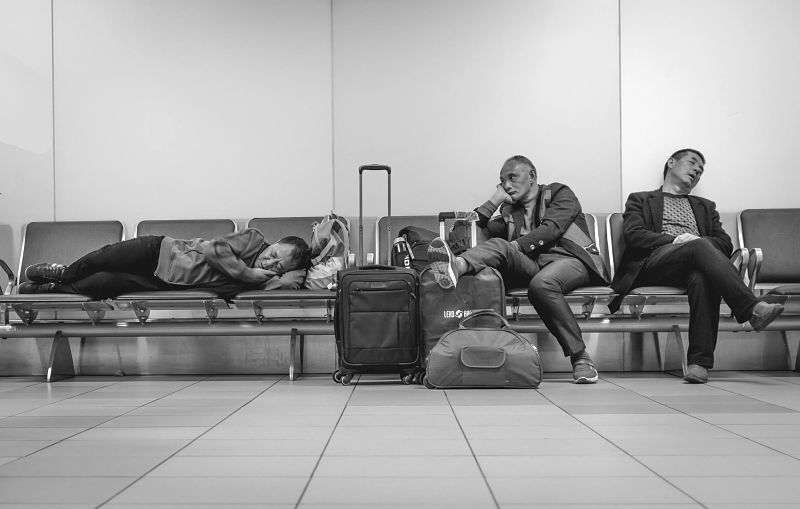
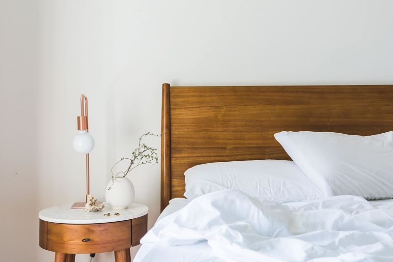
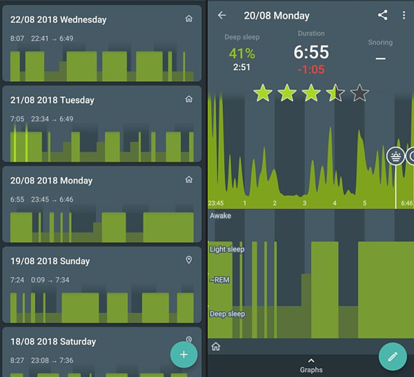

> A condition of body and mind which typically recurs for several hours every night, in which the nervous system is inactive, the eyes closed, the postural muscles relaxed, and consciousness practically suspended (Oxford dictionary).

Studies have shown that 1 out of every 2 adults in America is not getting the recommended hours of sleep. 1 out of 3 people is trying to survive on 6 hours or less.

Adults need from 7 to 9 hours of sleep per day, but the average American is sleeping only **6.5 hours** during the week. This used to be **7.9 hours** in 1942.

There are numbers of important processes happening during the night like muscle repair and growth as well as a body cleanse. There is a sewage system in the brain cleaning the brain of metabolic toxins that we accumulate during the day.

> Like humans, most animals sleep for at least a few hours per day. Dolphins are an interesting example. They are conscious breathers and in order not to drown, they need to go to the surface and breathe. They float and shut half of their brain during sleep and keep the other half active to maintain the basic body functions active.

`youtube: https://www.youtube.com/watch?v=1ZSzI5mHwS8`

Let's explore what affects sleep.

### What is a circadian rhythm?

It's a 24-hour internal clock, a regulator for sleepiness and wakefulness. When we feel the most energized can vary a bit from person to person, but for most adults, there is a noticeable drop in energy from 1 to 3 in the afternoon and from 2 to 4 at night.

Outside factors, such as lightness and darkness, can also have an impact on the internal clock. The brain sends a signal to the body to release melatonin which makes you sleepy.

### Effects of sleep deprivation

Human beings are the only species that deprive themselves of sleep and are not wired to compensate for the lack of sleep. Sleep is not like a bank. We can't accumulate a debt and hope to pay it off on the weekend.

Effects of sleep deprivation can show:

- **Worsened brain performance**. Getting less than 6 hours of sleep will drop the time to physical exhaustion by 30%.

- **Lower muscle strength**. The less sleep you get, the lower your muscle, jump height and running speed.

- **Lack of testosterone**. Men who sleep only 5 to 6 hours a night will have a level of testosterone 6-10 years their senior.

- **Diseases**. Long term lack of sleep is also connected to diseases, one of them is Alzheimer's.

This may come as a shocker, but drowsy, sleep deprived driving kills more people on the roads than alcohol and drugs combined.

### How to improve sleep?

Here are some tips to help you with a good night's sleep:

- **Keep a regular sleep schedule**. Go to bed at the same time every day, even on weekends if possible. This way, you'll train the body to always fall asleep at the same time.

- **Avoid screen time before bed**. Blue light, emitted from mobile phones, can postpone melatonin production, which is needed for the body to feel sleepy. One hour of screen time can postpone sleepiness for up to 3 hours.

- **Cool, clean and quiet bedroom**. Bedroom temperature should be between 60 and 67 degrees Fahrenheit (15 to 20 degrees Celsius). Eliminate any noises that can disturb sleep and black out any sources of light from outside lamps or electronic devices.

- **Eat 2 to 3 hours before bed**. This way, you won't be too hungry or too full when going to bed.

### "There is an app for that."

To measure the quality of your sleep, I recommend downloading an app called [Sleep as Android](https://play.google.com/store/apps/details?id=com.urbandroid.sleep), available for Android.

It allows you to track sleep and use an ability to set up "smart" alarms, waking you up at the end of the sleep cycle. There are similar apps for iOS as well.

### Conclusion

Sleep is significant for optimal health and well-being. If you would like to get more sleep, try some of the tips above.

**And remember, less sleep doesn't mean more productivity**.

Do you have problems falling asleep? Are you using a technique or a gadget to fall asleep easier? I look forward to hearing your comments.

### Resources

`youtube: https://www.youtube.com/watch?v=pwaWilO_Pig`

- https://www.sleepfoundation.org/ (National Sleep Foundation)
- https://www.sleep.org/ (Sleep.org by National Sleep Foundation)
