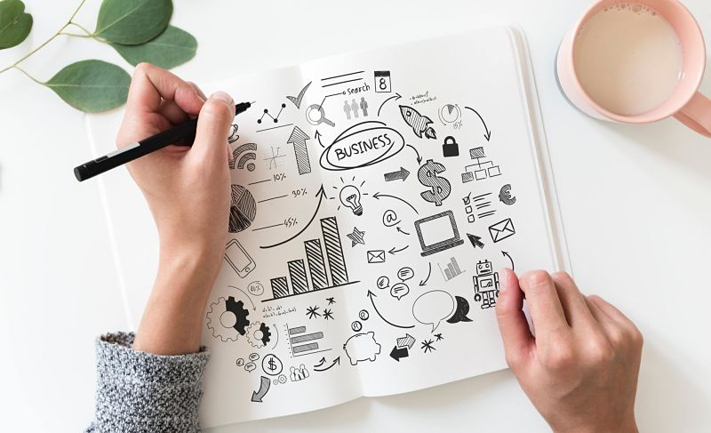

Do you ever get stressed about all the things that need to be done in a day?

Following a well-proven system of managing tasks can help track what you have to do and prevent the stress of managing them in the head.

### Getting things done

I follow the _Getting Things Done_ methodology of handling tasks for both work and personal projects. This method was popularized by David Allen and there is a book with the same name, which I highly recommend reading.

The gist of the system is that it encourages you to put everything that needs to get completed out of the head into a system. The result is that your brain power isn't used for storing tasks and events but for creative thinking and problem-solving.

You can store the projects and tasks in either a physical notebook, an Excel sheet or a specialized to-do software like Todoist. Put them into the system and don't worry about them.

### Organizing the list

- Every task you think of or want to do goes into the general list of tasks, called Inbox. Make the tasks actionable. For instance, instead of naming a task "birthday cake", name it "buy a birthday cake for Jane".

- Set up projects and assign tasks to them. Some of my projects are called work, home, reading list, blog, places to visit, shopping list.

- Prioritize the tasks. There's a scale, you can use, with the highest priority called p1 and the lowest one being p4. If you are doing a project for a customer, sync with the managers on what task should take the priority.

- If it's a short task, taking only a minute or two, do it right away.

### Daily tasks

Once you've prioritized the list, plan a day's worth of tasks either the night before or in the morning. I plan for around 5-7 tasks a day, usually about 5 for work and 1-2 for personal projects.

**Start the day with the most important and urgent task. This way you'll avoid getting stuck on an irrelevant assignment and will make the most of the daily brain capacity.**

A great book about this topic is _Eat That Frog!_ by Brian Tracy.

### Weekly review

Keep the list of tasks fresh. I constantly add new tasks to the Inbox and once a week I go over the list and assign tasks to the correct project and schedule them.

If the task doesn't have a clear action to take, either remove it from the list or move it to a "someday project" list.

### Combining with other software tools

If you use another project tracking system for work tasks, something like Jira, Asana or Trello, you can integrate them with the task software.

If it doesn't offer an integration, just copy the names of tasks to the to-do list. It's a bit of annoying, but it forces you to think more about the ticket. Jumping prematurely into the ticket without thinking about it, and getting stuck in the middle of it, is usually a bigger problem than duplication.

If you need to report worked hours as a freelancer or your employer requires it, you can just copy the completed tasks from the to-do list.

### Conclusion

Like forming a habit, getting used to a methodology takes time. After a while of using it, you will feel freer because you have offloaded the work from the brain to the system.

Let me know if you are using a similar task system. What is the biggest challenge you are facing concerning managing tasks?

---

## Resources

- https://hamberg.no/gtd/ (GTD in 15 minutes)
- https://www.amazon.com/Eat-That-Frog-Great-Procrastinating-ebook/dp/B001AFF25W (Eat That Frog!, Brian Tracy)
- https://www.amazon.com/Getting-Things-Done-Stress-Free-Productivity-ebook/dp/B00KWG9M2E (Getting Things Done: The Art of Stress-Free Productivity, David Allen)
- http://todoist.com (Todoist software)
